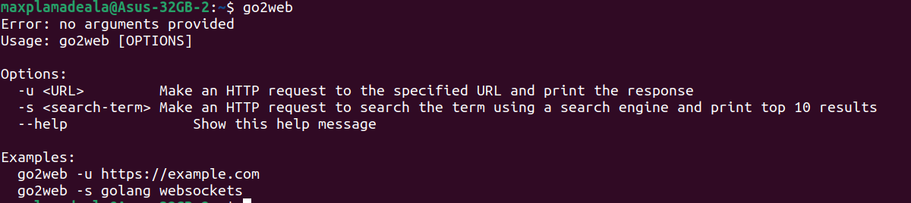
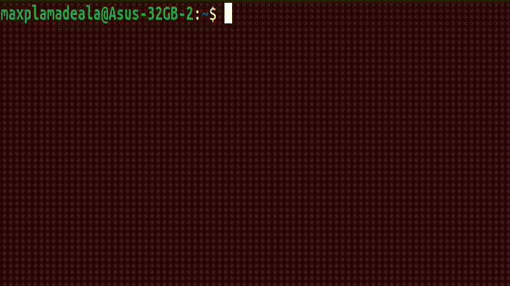

## To build it use:
```
go build -o go2web ./cmd/go2web
```

## Made as a script using this script:

```
mkdir -p ~/bin
vim ~/bin/go2web
```

Inside write:
```
#!/bin/bash
/home/maxplamadeala/go2web/go2web"$@"
```
Make it executable:
```
chmod +x ~/bin/go2web
```

Export and save:
```
echo 'export PATH="$HOME/bin:$PATH"' >> ~/.bashrc
source ~/.bashrc
```
Test if works:


## the gif


